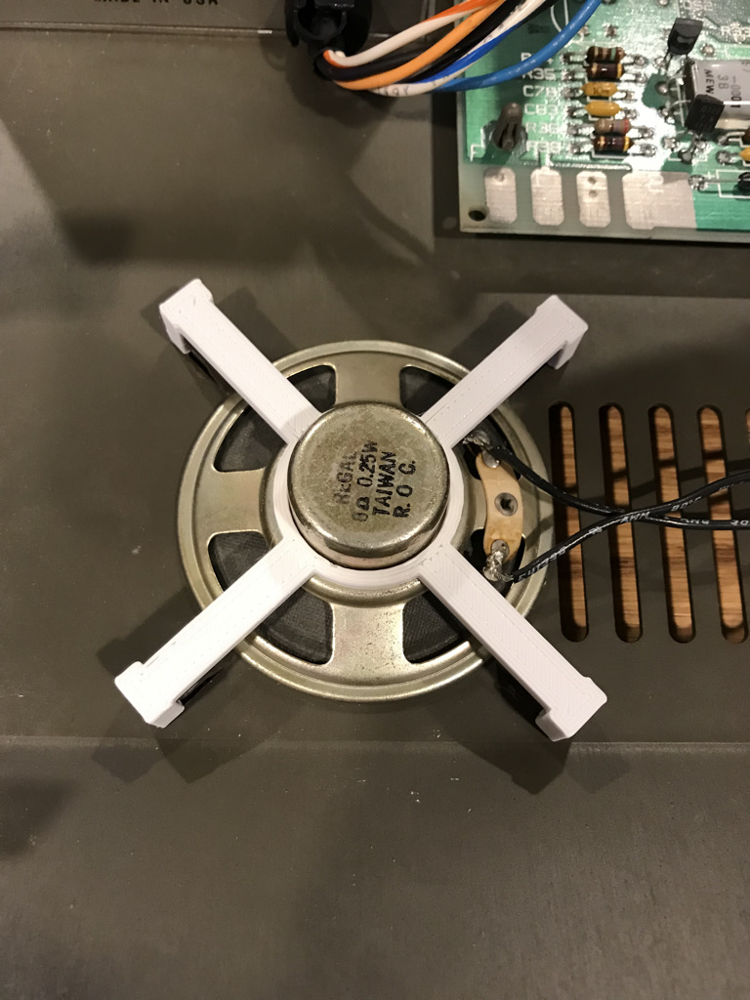

CAD geometries for use with Apple II
====================================

Did the elastic band fixing your speaker to the chassis break long ago?  Try printing `speaker-holder.stl`.  This fits right over your speaker and snaps onto the four tabs built into the chassis.  You can use [OpenSCAD](https://openscad.org) to modify the `.scad` source file in case your speaker dimensions are a little different (this relies on accurate tolerances for snapping action).  The way it should look after being installed is shown in the photo.  I used PLA+ for this particular print.

